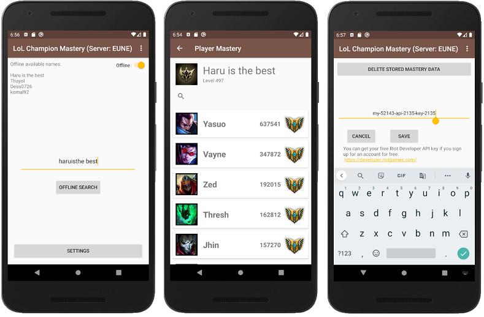
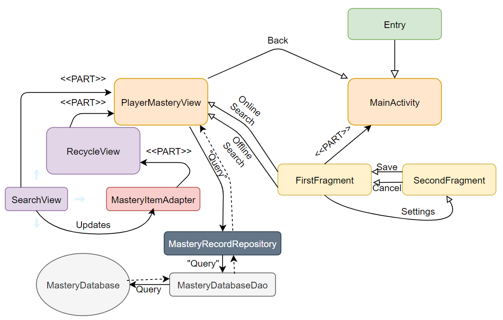
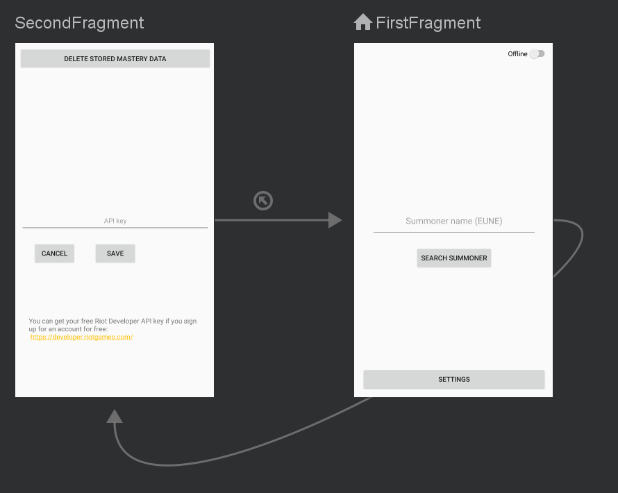

# android-champmastery
## League of Legends Champion Mastery checker
Android Project for Kotlin class: LoL Champion Mastery
## Basic Functionality
* Connects to Riot API endpoint
* Sends requests, fetches replies
* Assembles a custom data structure
* Saves to local database
* Presents the data in a stylish way
* Filters the data
* Loads already existing data in offline mode
## Extra Functionality
* The database can be cleared from the in-app settings without having to clear the whole app's data. This also means that the API key is not reset.
* When offline mode is enabled, the list of available names pops up.
## Images
### Screenshots

### Relations

### Fragment navigation in MainActivity

